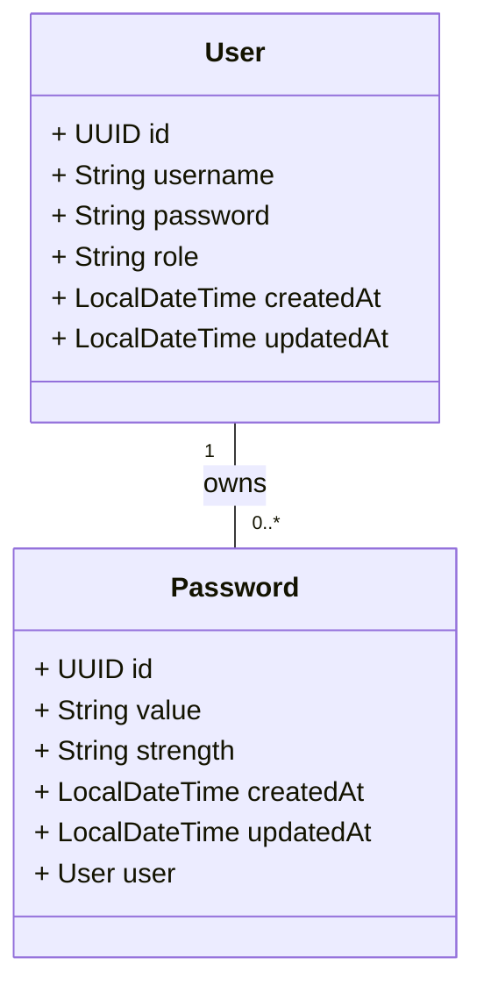

# Secure Pass

This application is a group of services that help users to generate, check, and store secure passwords. It's built with Java, Spring Boot, PostgreSQL, and Docker.

It's my implementation of the Password Generator and Password Checker challenges from the [Back-end Challenges](https://github.com/wesleybertipaglia/backend-challenges/) repository.

## Table of Contents

- [Features](#features)
- [Getting Started](#getting-started)
  - [Running with Docker](#running-with-docker)
  - [Running with Maven](#running-with-maven)
  - [Accessing the application](#accessing-the-application)
- [Endpoints](#endpoints)
- [Entities](#entities)
- [Contributing](#contributing)
- [License](#license)

## Features

The application includes the following functionalities:

- Password Generator
- Password Checker
- Password Storage

## Getting Started

### Running with Docker

The easiest way to run the application is with Docker.

**1. Prerequisites**

- **Docker**, you can download and install it from [here](https://www.docker.com/products/docker-desktop).
- **Docker Compose**, you can download and install it from [here](https://docs.docker.com/compose/install/).

**2. Create the .env file**

- Create a `.env` file in the root directory following the .env.example file.
- Edit the `.env` file and set the environment variables.

**3. Running**

To run the application, execute the following command:

```bash
docker-compose up
```

### Running with Maven

**1. Prerequisites**

- **Java 17**, you can download and install it from [here](https://www.oracle.com/java/technologies/downloads).
- **PostgreSQL**, you can download and install it from [here](https://www.postgresql.org/download/).

**2. Create the .env file**

- Create a `.env` file in the root directory following the .env.example file.
- Edit the `.env` file and set the environment variables.

**3. Running**

To run the application, execute the following command:

```bash
mvn spring-boot:run
```

### Accessing the application

- The application will be available at `http://localhost:8080`.
- The API documentation is available at `http://localhost:8080/swagger-ui.html`.


## Endpoints

The following table shows the available API endpoints:

### Auth
- `POST /auth/register`: Register a new user.
- `POST /auth/login`: Login with username and password.
- `POST /auth/logout`: Logout the current user.
- `POST /auth/refresh`: Refresh the access token.
- `GET /auth/me`: Get the current user.

### Password Generator
- `POST /passwords/generate`: Generate a new password.

### Password Checker
- `GET /passwords/strength`: Check the strength of a password.

### Password Storage
- `POST /passwords`: Store a password.
- `GET /passwords`: Get all stored passwords.
- `GET /passwords/{id}`: Get a stored password by id.
- `PUT /passwords/{id}`: Update a stored password by id.
- `DELETE /passwords/{id}`: Delete a stored password by id.

## Entities

The following Entity-Relationship Diagram (ERD) shows the properties of the Demo entity:



## Contributing
Contributions are welcome! Please fork the repository and submit a pull request with your changes.

## License
This project is licensed under the MIT License - see the [LICENSE](LICENSE) file for details.